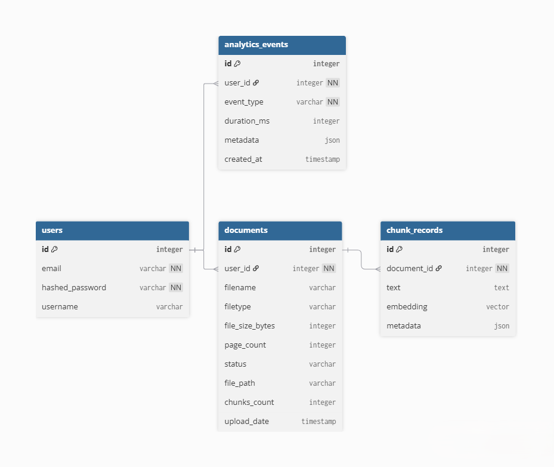

## ERD

### **users**
Stores basic authentication and account information for each user.

**Key fields**
- `id` – primary key  
- `email` – unique user email  
- `hashed_password` – securely stored password  
- `name` – optional user display name  

---

### **documents**
Represents files uploaded by the user that will be processed and indexed.

**Key fields**
- `id` – primary key  
- `user_id` – owner of the document  
- `name` – filename  
- `extension` – file extension (pdf, txt, etc.)  
- `status` – uploaded, processing, ready, error  
- `storage_path` – where the file is stored  
- `metadata` – JSON with optional document information  

---

### **chunk_records**
Contains extracted text fragments and associated vector embeddings generated during ingestion.

**Key fields**
- `id` – primary key  
- `document_id` – reference to the source document  
- `text` – chunk content  
- `embedding` – pgvector embedding  
- `position` – order of the chunk within the document  
- `metadata` – JSON with additional processing info  

---

### **analytics_events**
Tracks general usage and system events, including latency, costs, pipeline activity, or errors.

**Key fields**
- `id` – primary key  
- `user_id` – reference to the user  
- `event_type` – type of event (chat_query, ingestion_error, etc.)  
- `duration_ms` – optional processing time  
- `metadata` – JSON payload with dynamic details  
